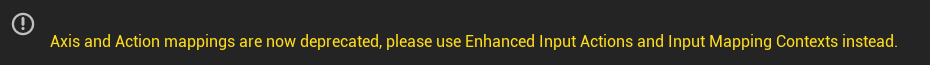
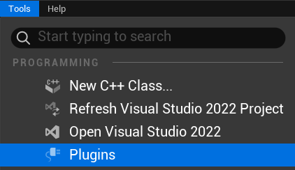
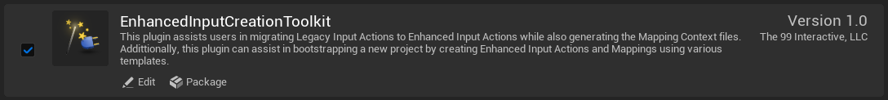
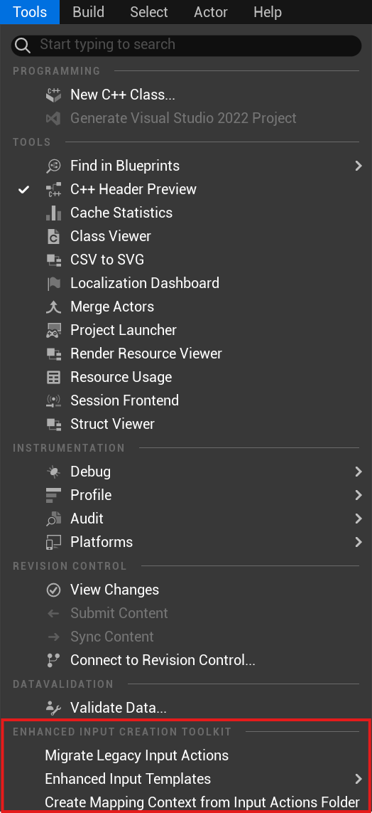
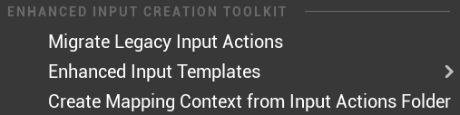

# Enhanced Input Creation Toolkit

The Enhanced Input Creation Toolkit plugin streamlines the process of migrating, templating, and generating Enhanced Input assets  in Unreal Engine. All features are accessible directly from the Unreal Editor UI.

## Features

- Migrate Legacy Input Actions: Convert legacy input setups to the Enhanced Input system.
- Enhanced Input Templates: Quickly create input templates for common game types.
- Create Mapping Context from Input Actions Folder: Batch-generate a new Input Mapping Context from all Input Actions in a folder.

## Why this tool?

Have you noticed the following warning in your project?

Unreal Engine has deprecated Axis and Action mappings, and is direction developers to utilize Enhanced Input Actions and Input Mapping Contexts instead. This tool allows for easier migration from the *Legacy* Axis and Action mapping system to the new Enhanced Input system by systematically identifying the *Legacy* Axis and Action mappings and converting them to Enhanced Input.

---
## Enabling the Enhanced Input Creation Toolkit Plugin
1. Navigate to the Plugins tab (`Tools -> Plugins`).

   

2. Search for and enable the "`EnhancedInputCreationToolkit`" plugin.

   

3. Find the `Enhanced Input Creation Toolkit` section of the Tools menue in the world editor.

   
---
## Getting Started

### Accessing the `Enhanced Input Creation Toolkit`

   After enabling the plugin and restarting the editor:
   - Go to the Tools menu in the main Unreal Editor menu bar.
   - Find the Enhanced Input Migration section.

   You will see the following options:
   - Migrate Legacy Input Actions
   - Enhanced Input Templates (submenu)
   - Create Mapping Context from Input Actions Folder

   

---

### Migrate Legacy Input Actions

The `Migrate Legacy Input Actions` option searches for any input actions that are mapped to the current project (`Edit -> Project Preferences -> Input`), and processes these to create new `Input Actions` and `Input Mapping Contexts`. The `Input Actions` contain the action name and the type (boolean, float, 1D Axis, 2D Axis, etc..) while the `Input Mapping Contexts` contain the actual key mappings. The key mappings are retained from the identified *Legacy* Axis and Action mappings for use in the new Enhanced Input system.

Steps to Migrate Legacy Input Actions:
   1.	Click `Migrate Legacy Input Actions`.
   2.	Select the output folder for the migrated Enhanced Input assets.
   3.	The plugin will process and migrate your legacy input actions, displaying a success or error message when complete.

> **NOTE**: During migration, the system does its best to try and identify `2D Axis` actions for look and movement in an effort to convert them into a single `2D Axis` input for each action (Look and Move). In the *Legacy* Axis mappings, the X and Y Axes are mapped separately, such as "MoveForward" along the Y Axis and "MoveRight" along the X Axis. This is not the expected nor optimal behavior for Enhanced Input. I have attempted to consolidate this to a single `2D Axis` if it's identifiable based on the naming scheme (Keywords: Look, Move, Turn).

For screenshot examples of this in action, check out the [Migrate Legacy Input Actions example.](./examples/MigrateLegacyInputActions.md)

---

### Create Enhanced Input Templates

The `Create Enhanced Input Templates` menu options allow a developer to rapidly generate the required `Input Action` and `Input Mapping Context` files required to get a project started. These templates are designed to help with rapid prototyping during a Game Jam, dream game, or other project. The list of templates is not all inclusive nor is the output restricted to use in a specific game genre.

   1.	Hover over `Enhanced Input Templates` to open the submenu.
   2.	Select a template (e.g., "First Person", "Third Person", etc.).
   3.	Choose the output folder for the template assets.
   4.	The plugin will generate the selected template in the chosen folder.

> **NOTE**: This process will generate the template `Input Actions` and `Input Mapping Context` files for the specified template. They key mappings may not match your desired values. Please take time to view and modify them as necessary.

For screenshot examples of this in action, check out the [Create Enhanced Input from Template example.](./examples/CreateEnhancedInputTemplate.md)

---

### Create Mapping Context from Input Actions Folder

The `Create Mapping Context from Input Actions Folder` is setup to enable a developer to quickly create an `Input Mapping Context` file from a folder that contains a list of already created `Input Actions`. The process allows a developer to quickly generate the `Input Mapping Context` file without having to painstakingly add each `Input Action` individually into the mapping context. ***Note that the `Input Mapping Context` will contain the list of mapped `Input Actions`; however, all of the key mappings will be empty by default.***

   1.	Click Create Mapping Context from Input Actions Folder.
   2.	Select the folder containing your existing Input Actions.
   3.	Select the output folder where the new Input Mapping Context should be saved.
   4.	Enter a name for the new Mapping Context asset.
   5.	The plugin will create a new Mapping Context asset that includes all Input Actions found in the source folder.

> **NOTE**: This process will create an `Input Mapping Context` file with no key mappings. You will need to set the key mappings which you desire.

For screenshot examples of this in action, check out the [Create Mapping Context from Input Action Folder.](./examples/CreateMappingContextFromInputActionsFolder.md)

---
Additional Notes:

- All actions are performed via modal dialogs for folder and asset name selection.
- The plugin uses Unreal’s Content Browser and Asset Tools for asset creation and management.
- If you encounter warnings about asset registry filters, ensure you are using Unreal Engine 5.2 or later and that the plugin is up to date.

---

Support:

For bugs or feature requests, please create a [New Issue](https://github.com/The99Interactive/EnhancedInputCreationToolkit/issues).
