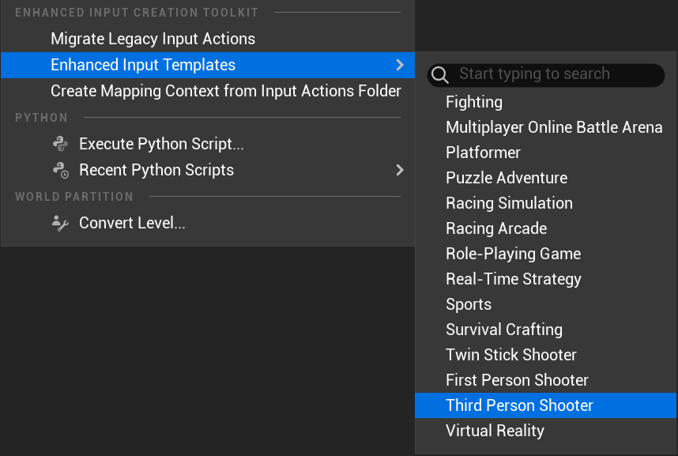
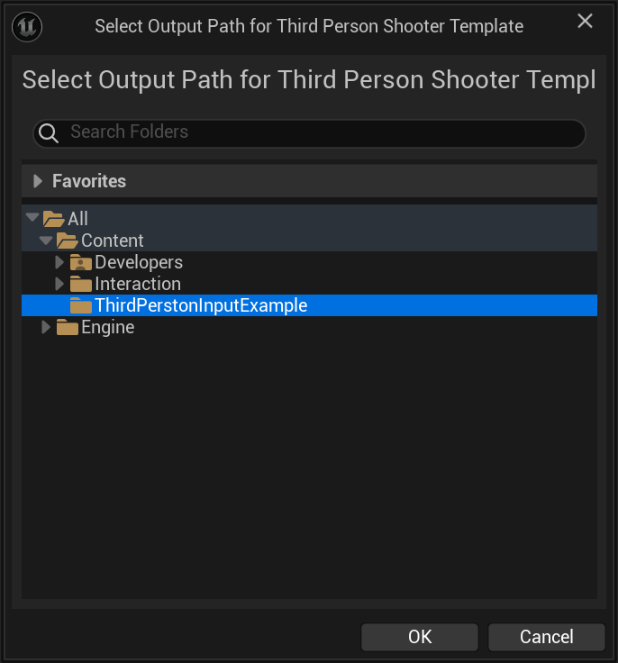
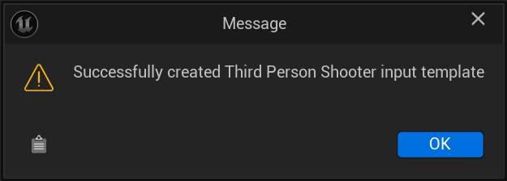
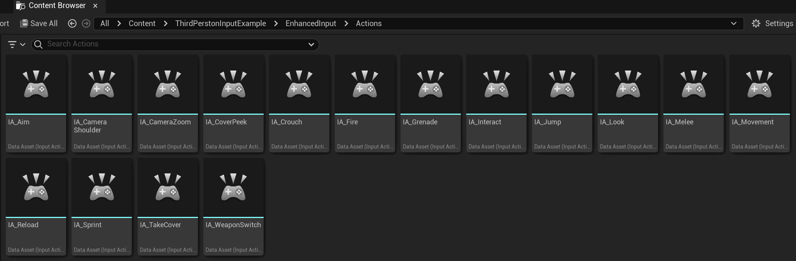
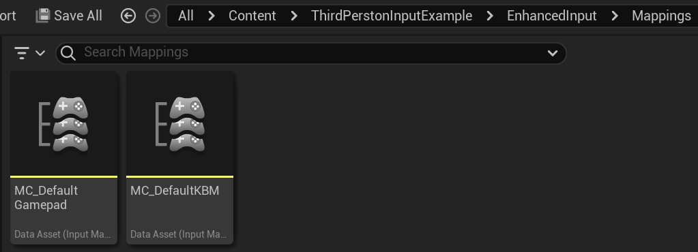
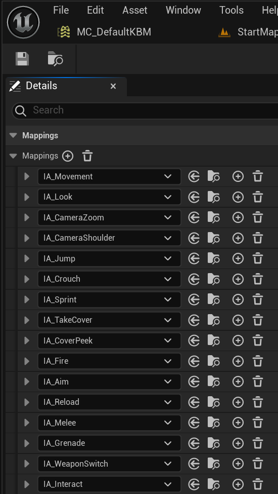

# Create Enhanced Input from Template

This plugin provides various templates to be used for creating both `Input Actions` and `Input Mapping Contexts` on the fly. 

1. Hover over `Enhanced Input Templates` to open the submenu.

2. Select a template (e.g., "First Person", "Third Person", etc.). In this case, I'm selecting Third Person Shooter.

   

3. Choose the output folder for the template assets. I created ThirdPersonInputExample folder.

   

4. Success prompt upon completion.

   

5. The plugin will generate the selected template Input Actions and Mappings in the in the chosen folder.

   

   

   