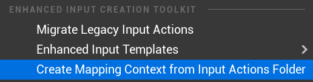
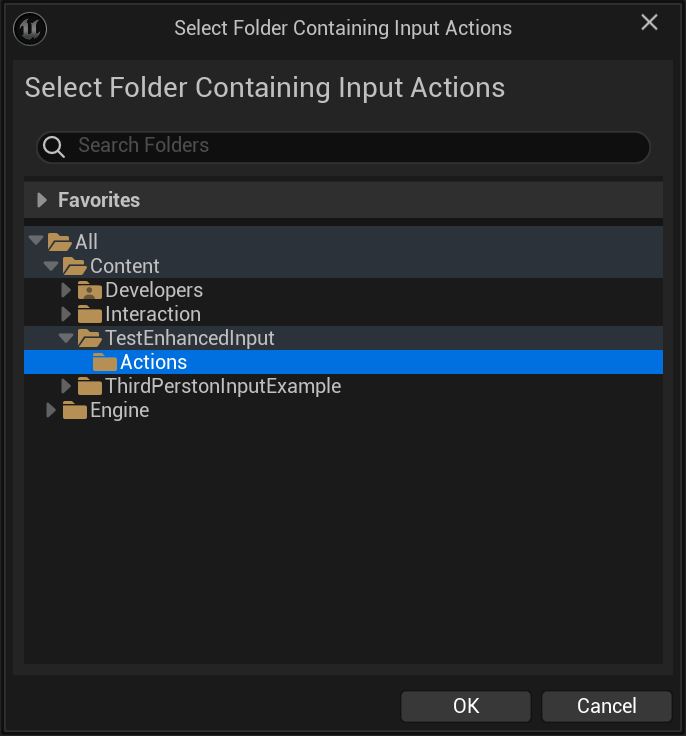
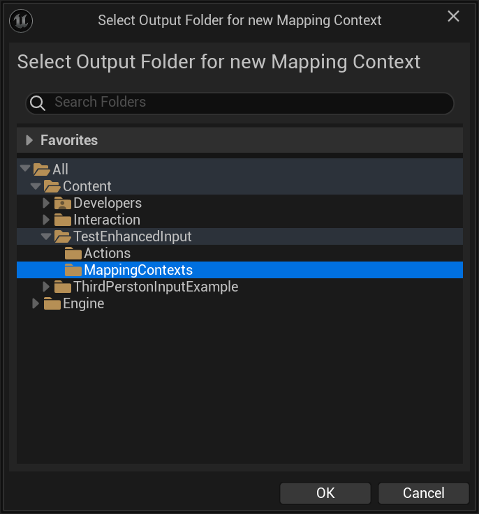
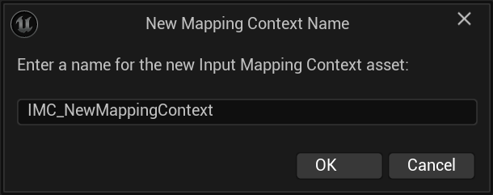
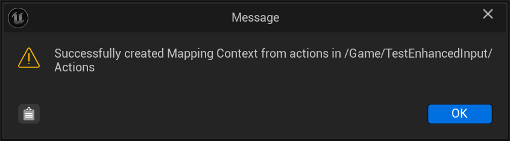
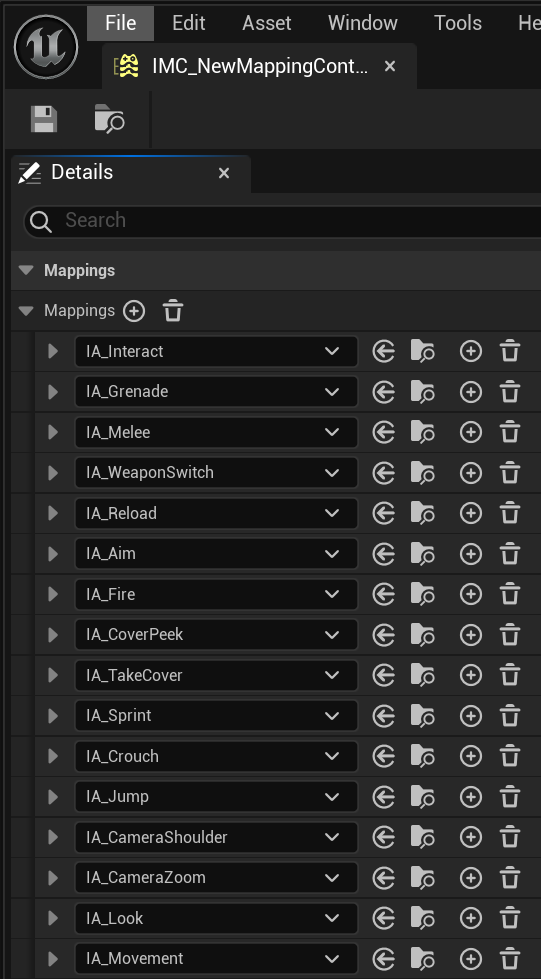

# Create Mapping Context from Input Actions Folder
1. Click Create Mapping Context from Input Actions Folder.

   

2. Select the folder containing your existing Input Actions.

   

3. Select the output folder where the new Input Mapping Context should be saved.

   

4. Enter a name for the new Mapping Context asset.

   

   

5. The plugin will create a new Mapping Context asset that includes all Input Actions found in the source folder.

   