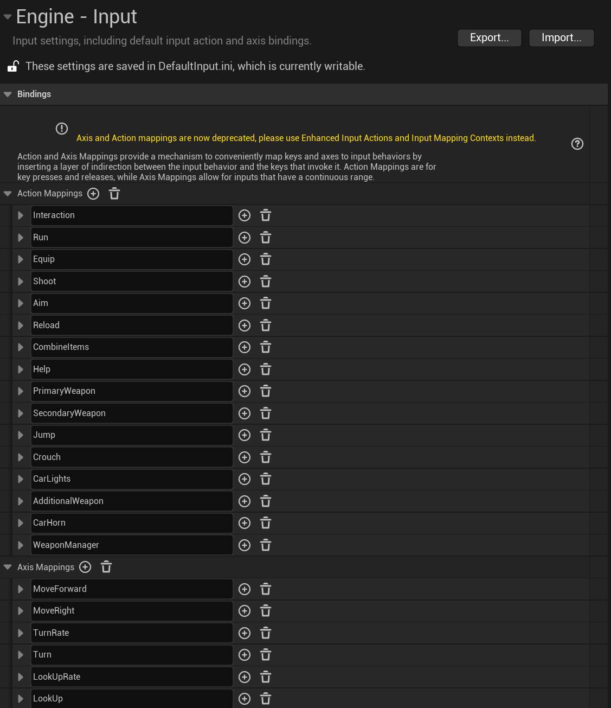
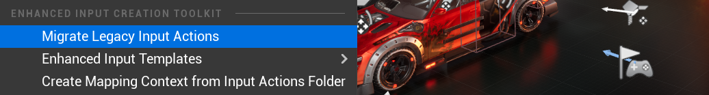
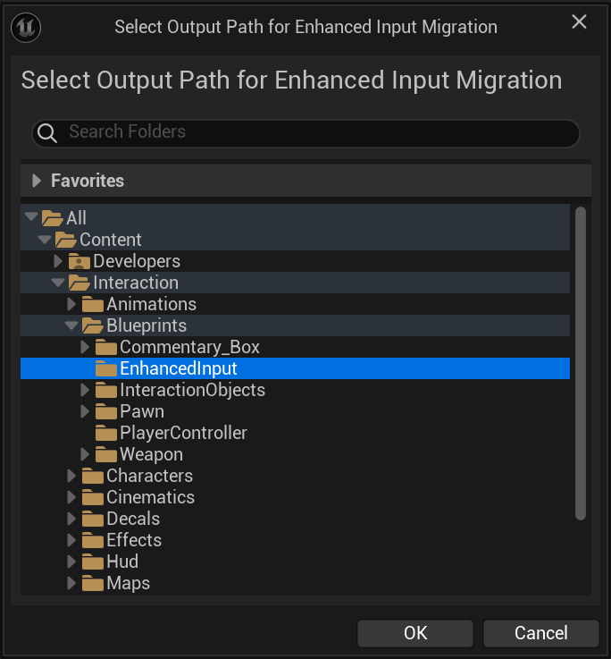
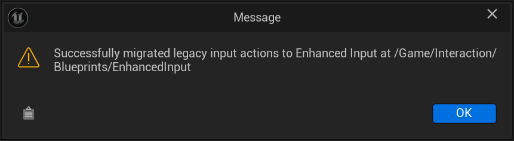
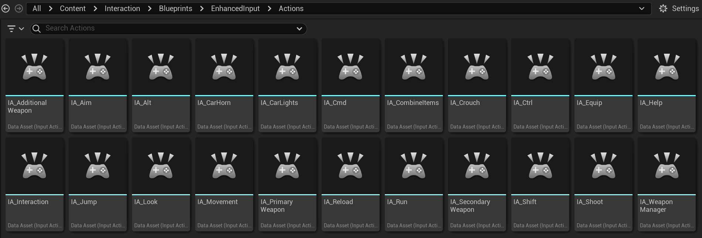
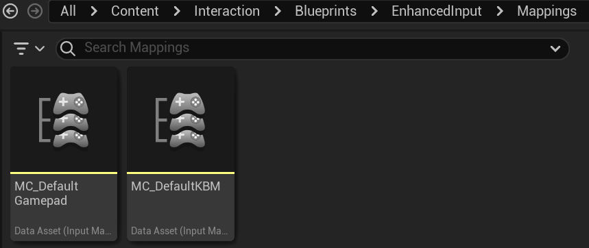
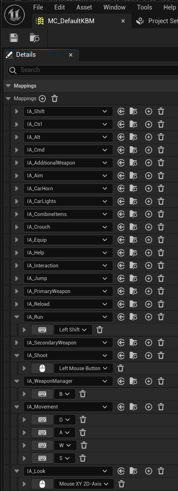

# Character Interaction Default Axis and Action Mappings

The following screenshots are performed from UE 5.4, using the ZzGertzZ's [Character Interaction ](https://www.fab.com/listings/634e2ef5-84cb-4bb4-9236-f2d97f2fe930). This project template maintains support for UE 4.25 through UE 5.6, and therefor implements the *Legacy* Axis and Action mappings.

The following are the default Axis and Action mappings for Character Interaction:

   1. Navigate to `Click Migrate Legacy Input Actions`

   

   2. Select Output Path for Enhanced Input Migration

   

   3. Script will run and migrate the *Legacy* input mappings. A notification will appear upon completion.

   

   4. Validate Output for Input Actions:

   

   5. Validate Output for Input Mapping Contexts:

   

   6. Validate the mapping key values:

   